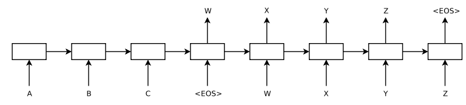

# Attention

---
Reference:
 - seq2seq 논문 [[paper]](https://arxiv.org/abs/1409.3215)
 - https://jalammar.github.io/visualizing-neural-machine-translation-mechanics-of-seq2seq-models-with-attention/
 - https://gaussian37.github.io/dl-concept-attention/
 - https://wikidocs.net/22893
---

## Seq2seq 모델

- Encoder와 Decoder로 구성
- Encoder
    - 각 단어의 embedding과 RNN의 hidden state를 거쳐 정보를 압축
    - Encoder의 마지막 부분의 출력이 context vector가 된다.
    - context vector는 고정된 길이의 벡터
- Decoder
    - context vector을 입력으로 받는다.
    - Decoder의 첫 부분은 문장의 처음을 표시하는 \<SOS\>(Start of Sequence)를 입력으로 받는다.
    - RNN을 거친 다음, hidden state는 다음 step으로 연결된다.
    - RNN의 출력은 다시 RNN의 입력으로 들어간다.

- 문제점
    - Decoder가 context vector만 사용
        - Gradient vanishing 문제 발생 가능
        - context vector에 각 단어의 의미를 함축시키는 과정에서 정보의 손실이 발생
    

## Attention function

입력 sequence의 각 단어들에 대한 가중치를 계산

Query, Key, Value 세 가지 요소로 구성

Query: t 시점에서 디코더 셀에서의 hidden state
Key: 모든 시점의 인코더 셀의 hidden state
Value: 모든 시점의 인코더 셀의 hidden state

## Self Attention
