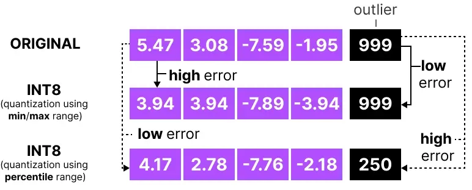
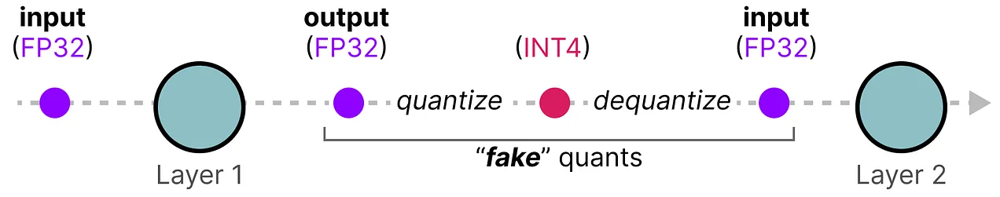
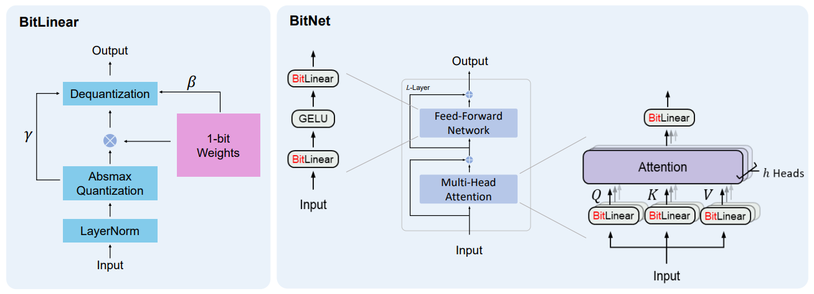

# Quantization(양자화)

---
Reference:
 - https://mlabonne.github.io/blog/posts/Introduction_to_Weight_Quantization.html
 - survey 논문 [[paper1]](https://arxiv.org/abs/2405.00314), [[paper2]](https://arxiv.org/abs/2103.13630)
 - 정리 Github [awesome-vit-quantization-acceleration](https://github.com/DD-DuDa/awesome-vit-quantization-acceleration?tab=readme-ov-file)
 - [GPTQ](https://arxiv.org/abs/2210.17323)
 - https://arxiv.org/abs/1712.05877
 - https://gaussian37.github.io/dl-concept-quantization/
 - https://newsletter.maartengrootendorst.com/p/a-visual-guide-to-quantization
 - https://medium.com/@sachinsoni600517/introduction-to-model-quantization-4effc7a17000
---

## Quantization
- 모델의 성능 저하를 최소화하며 계산 비용을 낮추는 기술
- 높은 정밀도의 모델을 낮은 정밀도로 변환하는 기술

#### 필요성:
- 컴퓨팅 자원 및 메모리가 제한된 환경에서 고품질 사용자 경험을 제공하기 위함
- Transformer 기반 모델의 self-attention 메커니즘으로 계산량과 메모리 요구량 증가
- INT8 연산이 FP16 또는 FP32 연산보다 빠르다.

> (왼쪽): Titan RTX와 A100 GPU의 서로 다른 bit-precision logic에 따른 최대 처리량 비교  
(오른쪽: 45nm 기술을 사용했을 때, 서로 다른 정밀도의 에너지 비용과 상대 면적 비용)  
-> 정밀도가 낮을수록 에너지 효율성이 기하급수적으로 향상되고 처리량이 높아진다.

https://moon-walker.medium.com/pim%EC%9D%80-ai-%EA%B0%80%EC%86%8D%EA%B8%B0%EC%9D%98-%EB%AF%B8%EB%9E%98%EA%B0%80-%EB%90%A0-%EA%B2%83%EC%9D%B8%EA%B0%80-%EC%82%BC%EC%84%B1%EC%9D%98-mi100-pim-2320c6bca73e

- Arithmetic Intensity 설명 참고하기

---
## IEEE 방식 부동 소수점

Sign Bits, Exponent(지수) Bits, Mantissa(가수) Bits로 구성

> 예: $-118.625$를 이진수로 나타내기  
${118}_{10} = {1110110}_{2}$  
${0.625}_{10} = {0.101}_{2}$  
왼쪽에 1이 남도록 소수점 이동(정규화): $1.110110101 \times 2^6$  
부호부: 음수이므로 1  
가수부: 부족한 비트는 0으로 채워서 23비트를 만든다: $11011010100000000000000$  
지수부: 6에 Bias 127을 더해서 133을 이진법으로 변환: $10000101$

자료형에 따른 비트 수
|---|부호 비트|지수 비트|가수 비트|
|---|---|---|---|
|FP16|1|5|10|
|FP32|1|8|23|
|BF16|1|8|7|

Precision(정밀도)가 낮아지면
- 표현 가능한 범위를 벗어난 값은 버려지게 된다.
- 값의 용량을 줄일 수 있다.
- 계산 복잡도를 줄일 수 있다.

### FP32 변환 [(이미지 출처)](https://newsletter.maartengrootendorst.com/p/a-visual-guide-to-quantization)

#### FP16
FP32보다 값의 범위가 매우 작다

#### BF16
FP32와 값의 범위는 동일하지만 정밀도가 낮다. 주로 딥러닝에서 사용한다.

#### INT8

---
## 양자화 개요

### Linear Quantization

선형 변환(양자화 수준의 간격이 동일함)

**양자화**

$\displaystyle q = round(\frac{r}{S})+Z$  
> r: input real number. 입력 실수값  
> q: output quantized integers. 출력 정수값  
> S: real-valued **scaling factor**  
> Z: integer zero point

**역양자화**

$\displaystyle \tilde{r} = S(q - Z)$

> **양자화 오류**  
양자화한 값을 다시 역양자화할 때 정밀도 손실로 발생하는 차이

### Uniform & Non-uniform Quantization

> **Uniform & Non-uniform Quantization 비교**  
(왼쪽): Uniform quantization  
(오른쪽): Non-uniform quantization  
연속 도메인 r의 실제 값은 양자화된 도메인 Q의 더 낮은 정밀도의 불연속 값으로 매핑된다(주황색 표시)  
양자화된 값 사이의 거리는 uniform quantization에서 동일하지만 non-uniform quantization에서는 동일하지 않다.

#### Uniform Quantization

#### Non-uniform Quantization

### Symmetric & Asymmetric Quantization

#### 비대칭 양자화(Asymmetric Quantization)

$\displaystyle S = \frac{r_{max}-r_{min}}{q_{max}-q_{min}}$

> $[r_{max},r_{min}]$: real number clipping range  
> $[q_{max},q_{min}]$: integer clipping range

- S가 $r_{max},r_{min}$에서 파생되는 경우, 0을 기점으로 대칭이 아니다.
- 범위가 대칭이 아니거나 기울어져 있을 경우 적합

#### 대칭 양자화(Symmetric Quantization)
$\displaystyle S = \frac{2 \times max(|r|)}{q_{max}-q_{min}}$

- clipping range가 대칭일 경우, $Z = 0$

- 2가지 모드 존재
    - full range
    $\displaystyle S = \frac{2max(|r|)}{2^{n} -1}$  
    (n: quantization bit)  
    INT8이 $[-128, 127]$의 범위를 가짐
    - restricted range
    $\displaystyle S = \frac{max(|r|)}{2^{n - 1} -1}$  
    (n: quantization bit)  
    INT8이 $[-127, 127]$의 범위를 가짐

- 최대/최소 범위를 그대로 사용하면 outlier에 민감하다.  
-> Percentile 이나 KL divergence 전략을 사용하기도 한다.

### 양자화 방법

#### Absmax 양자화
- INT8의 경우, $X$를 $|X|$의 최대값으로 나눈 후 127을 곱해서 입력을 $[-127, 127]$ 범위로 매핑
- 양자화:  
$\displaystyle X_{quant} = round(\frac{127}{max |X|} \cdot X)$
- 역양자화:   
$\displaystyle X_{dequant} = round(\frac{max |x|}{127} \cdot X_{quant})$

#### Zero-point Quantization
- 비대칭 입력 분포를 고려할 수 있다 (ReLU의 출력을 고려할 때 유용)
- INT8의 경우, 값의 총 범위(255)를 최대값과 최소값의 차이로 나누어 스케일링한 다음, 영점으로 이동하여 [-128, 127] 범위로 매핑
- $\displaystyle scale = \frac{255}{max(X) - min(X)}$
- $\displaystyle zeropoint = -round(scale \cdot min(X)) - 128$
- 양자화:  
$\displaystyle X_{quant} = round(scale \cdot X + zeropoint)$
- 역양자화:  
$\displaystyle X_{dequant} = \frac{X_{quant} - zeropoint}{scale}$

### Calibration

clipping 범위를 선택하는 과정
- 가능한 많은 값을 포함하면서 양자화 오류를 최소화하는 범위를 찾는 것이 목표
- 보통 Bias 말고 가중치만 양자화하는 것을 고려

보정 방법
- 입력 범위의 백분위를 수동으로 선택
- 기존과 양자화된 가중치 간의 MSE 최적화
- 기존과 양자화된 값의 엔트로피 최적화(KL-divergence)

### Static and Dynamic Quantization
- 가중치의 clipping range는 추론 전에 정적으로 계산 가능하다.
- activation은 그렇지 않다.
    - 예를 들어, ReLU를 사용한다고 했을 때 가중치가 INT8로 양자화되어 [0, 255]의 범위를 갖는다면 ReLU는 아무 기능을 하지 않는 셈이다.

**activation 범위가 언제 결정되는지에 따른 두 가지 양자화**
- **Dynamic quantization**
    - 가중치는 사전에 양자화하지만 activation은 추론 중에 동적으로 양자화.
    (양자화된 가중치로 연산한 값을 역양자화 한 다음 activation의 입력으로 사용)
    - 입력 지표(min, max, percentile, 등)를 즉시 계산해야 하므로 계산 비용이 크게 증가할 수 있다.
    - 각 개별 입력에 대한 신호 범위를 정확하게 결정하므로 일반적으로 높은 정밀도를 달성한다.
    - 모델을 메모리에 로드하는 속도 개선
    - 연산속도 향상은 미미하다.

- **Static quantization**
    - 가중치와 activation을 양자화
    - 가능한 경우, activation을 이전 layer과 합친다(fusion)
    - runtime 이전에 범위가 미리 계산된다.
    - 계산 비용이 증가하지 않지만 정확도가 떨어진다.
    - 방법
        - 일련의 calibration input set을 사용하여 activation의 average range를 결정
        - MSE 또는 entropy를 metric으로 사용하여 최적의 range를 선택
        - 훈련동안, clipping range를 학습

### Fusion

### 양자화 세분성
- clipping 범위의 결정은 세분성 수준에 따라 세 가지로 분류할 수 있다.
- 세분성이 더 미세해질수록 계산 오버헤드가 증가한다.

#### Layerwise Quantization
- layer 전체 매개변수에 대한 모든 통계를 고려하여 clipping 범위 결정
- 해당 layer의 모든 가중치에 대해 동일한 clipping 범위 사용
- 간단하지만 정확도가 떨어질 수 있다.

#### Channelwise Quantization
- 일반적인 방법
- 동일한 layer에서도 서로 다른 채널은 별도의 $S$(scaling factor)을 사용

#### Groupwise Quantization
- 가중치 또는 activation의 parameter 그룹에 대해 clipping 범위 결정
(예: 1024개의 채널이 있으면 128개씩 그룹을 지어 8개의 그룹을 만들고, 각 그룹마다 clipping 범위 결정)
- layerwise와 Channelwise에 비해 세분성이 더 미세할 수 있다.
- 가중치와 activation이 같은 layer에서 많이 다를 때 유용
- 상당한 오버헤드

## 양자화 기술

### PTQ(Post-Training Quantization. 훈련 후 양자화)
재학습이나 미세 조정 없이 사전 학습된 모델의 파라미터(가중치와 activation)를 양자화
- 사전 훈련된 모델과 보정 데이터를 사용하여 clipping 범위 및 scaling factor와 같은 하이퍼 파라미터를 보정하고 결정
- 소량의 데이터만 필요하기 때문에 오버헤드가 적다.
- 정밀도가 낮은 양자화의 경우 정확도가 낮아질 수 있다.

#### [GPTQ](https://arxiv.org/abs/2210.17323)

### QAT(Quantization-Aware Training. 훈련 중 양자화)

학습 중에 양자화를 통합

- 훈련 중에 가짜 양자화를 도입하여 여러 번 재훈련
(가중치를 양자화 한 다음 역양자화하여 훈련)

- backpropagation 계산에 부동 소수점을 사용
- 전체 재학습 기간동안 고정밀 가중치가 유지된다.
- 데이터로 모델을 재학습시키거나 fine-tuning 이후 양자화된 모델을 얻을 수 있다.
- 전체 학습 데이터에 접근해야 하고 매우 낮은 비트의 경우 시간이 많이 걸린다.
- 계산 비용이 많이 들고 훈련 데이터가 필요하다.

역전파 동안 양자화를 고려하지 않았다면 경사 하강법에 따라 가장 작은 손실을 갖는 가중치를 선택
-> 하지만 이 가중치가 **narrow minima**에 있을 때 더 큰 양자화 오류가 발생한다.

역전파 동안 양자화를 고려하면 양자화 오류가 훨씬 적은 **wide minima**에서 가중치를 선택한다.

-> PTQ는 고정밀도에서 낮은 손실을 갖고 QAT는 낮은 정밀도에서 낮은 손실을 갖는다.

### DFQ(Data-Free Quantization)
실제 데이터와 독립적으로 양자화

- 원래 학습 데이터와 유사한 가짜 데이터를 합성하여 실제 데이터 세트에 대한 필요성을 우회
- 이렇게 생성한 합성 데이터는 PTQ 중에 모델을 보정하고 QAT 내에서 fine-tuning을 수행하는데 사용된다.
- 데이터 볼륨, 개인 정보 보호 및 보안과 관련된 문제 해결 가능

### [BitNet](https://arxiv.org/abs/2310.11453)

- QAT 방식
- nn.Linear을 BitLinear로 변환
- BitLinear은 가중치를 중앙 집중화 한 다음 이진화
- absmax를 사용해서 activation 양자화
- ReLU와 같은 activation의 경우 음수가 되지 않도록 입력 값의 최소값을 빼서 범위를 조정

activation function 양자화 방법
- 양자화된 값을 실수로 변환 후 activation function을 거친 다음 다시 양자화
- LUT(Look-Up Table) 사용. 예를 들어, ReLU에 0부터 255까지의 값을 미치 계산하여 저장하고 이 값을 LUT에서 빠르게 참조