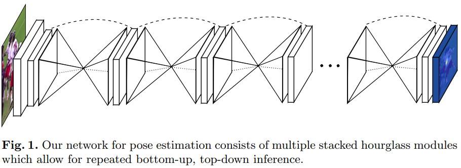

# Human Pose Estimation

---
Reference:
- https://viso.ai/deep-learning/pose-estimation-ultimate-overview/
- https://arxiv.org/abs/2012.13392
---
목차
1. [개요](#1-개요)
2. [방법](#2-방법)
    2-1. [2D Human Pose Estimation](#2-1-2d-human-pose-estimation)
    - 3D Human Pose Estimation

## 1. 개요
**Human Pose Estimation(HPE)**:
semantic key points들을 검출하고, key points들의 연관성을 찾고 추적하는 컴퓨터 비전 작업

### **필요성**:
- 헬스케어
- 스포츠
- VR/AR
- 게임

### **어려움**:
- 다양한 형태의 의복, 폐색(occlusion), 시야각에 따른 폐색, 배경 요소로 인해 신체의 모습이 동적으로 변한다.
- 조명 및 날씨와 같은 실제 세계의 변화에 민감해야 한다.

&nbsp;
### Human Body Modeling
시각적 입력 데이터에서 추출한 특징과 핵심 keypoints를 나타내는데 사용된다.

3가지 모델 존재

[출처](https://doi.org/10.1145/3603618)

- Kinematic Model
    - 인체 구조를 나타내는 일련의 관절 위치와 팔다리 방향이 포함된다.
    - 질감이나 모양 정보를 포현하는데 제한이 있다.
- Planar Model
    - 2D pose estimation에 사용
    - 인체의 모양과 형태를 표현하는데 사용된다.
    - 인체 윤곽을 근사하는 여러 개의 사각형으로 표현된다.
- Volumetric Model
    - 3D pose estimation에 사용

## 2. 방법

### 2.1. 2D Human Pose Estimation
이미지, 동영상 등에서 신체 keypoints의 위치를 추정

#### 2.1.1. 2D single-person pose estimation
입력 이미지에 여러 명이 있는 경우, 사람마다 patch를 잘라서 입력으로 사용

2가지 방법 존재
- Regression Methods
    
    [출처](https://doi.org/10.1145/3603618)

    - end-to-end 방식
    - key points의 위치를 직접 추정
    
    **논문 목록**
    - Toshev and Szegedy 2014. [[paper]](https://openaccess.thecvf.com/content_cvpr_2014/html/Toshev_DeepPose_Human_Pose_2014_CVPR_paper.html)
        

        - AlexNet을 BackBone으로 사용하는 cascaded network인 DeepPose 제안
        - first stage에서 keypoint 위치 예측. subsequent stage에서 이전 stage에서 예측한 keypoint 위치와 실제 위치의 변위 학습.
        - 이전 stage의 keypoint 예측 위치 주변의 이미지를 잘라서 다시 입력으로 사용
        - 모든 stage의 network 구조는 동일하지만 다른 network 사용

    - Sun et al. 2017. [[paper]](https://openaccess.thecvf.com/content_iccv_2017/html/Sun_Compositional_Human_Pose_ICCV_2017_paper.html)
        - ResNet-50을 기반으로 구조 인식 regression 방법 제안
        - 기존의 관절 기반 표현 대신 인체 정보와 포즈 구조를 포함하는 bone-based 표현을 채택
    - Luvizon et al. 2019. [[paper]](https://doi.org/10.1016/j.cag.2019.09.002)
        

        

        - soft-argmax 함수를 사용하여 feature을 관절 좌표로 변환

    - Li et al. 2021. [[paper]](https://openaccess.thecvf.com/content/CVPR2021/html/Li_Pose_Recognition_With_Cascade_Transformers_CVPR_2021_paper.html)
        

        
        
        

        - Transformer 기반 cascade network 설계
        - 관절과 외관의 상관관계는 self-attention mechanism에 의해 고려된다.

    - Li et al. 2021. [[paper]](https://openaccess.thecvf.com/content/ICCV2021/html/Li_Human_Pose_Regression_With_Residual_Log-Likelihood_Estimation_ICCV_2021_paper.html)
        

        

        - Residual Log-likelihood Estimation(RLE) 모델을 제안
        - network는 keypoint 좌표의 평균과 분산을 출력
        - flow model을 사용하여 $N(0, I)$에서 추출한 random variable $z$를 받아 zero-mean deformed distribution에 속한 $\bar{x}$를 생성.
        - flow model은 자신의 분포를 $\displaystyle \frac{P_{opt}(\bar{x})}{s \times Q(\bar{x})}$에 맞추고자 학습
        ($P_{opt}()$: 최적의 분포, $Q()$: 간단한 분포. 논문에서는 laplace distribution 사용. $s = \frac{1}{\int G_{\phi}(\bar{x})Q(\bar{x})d\bar{x}}$)
        - inference 시에는 flow model을 사용하지 않고 network 출력의 평균을 keypoint 좌표로 사용

    **multi-task learning**
    - Li et al. 2014. [[paper]](https://www.cv-foundation.org/openaccess/content_cvpr_workshops_2014/W15/html/LI_Heterogeneous_Multi-task_Learning_2014_CVPR_paper.html)
        

        - 다음 두 가지 작업으로 구성된 multi-task framework 제안
            - regressor을 사용하여 전체 이미지에서 관절 좌표를 예측
            - sliding window를 사용하여 patch에서 신체 부위를 감지(detector)

    - Fan et al. 2015. [[paper]](https://openaccess.thecvf.com/content_cvpr_2015/html/Fan_Combining_Local_Appearance_2015_CVPR_paper.html)
        

        - 다음 두 가지 작업을 위한 dual-source CNN 제안
            - patch에 신체 관절이 포함되어있는지 판단하는 joint detection
            - patch에서 관절의 정확한 위치를 찾는 joint localization
    
&nbsp;
- Heatmap-based Methods

    

    - 각 GT keypoints마다 heatmap을 생성하고 모델이 이 heatmap을 예측하도록 학습
    - regression과 비교했을 때: 공간 위치 정보를 보존하고, 훈련 프로세스가 더 원활할 수 있다.
    
    **논문 목록**
    - Wei et al. 2016. [[Paper]](https://openaccess.thecvf.com/content_cvpr_2016/html/Wei_Convolutional_Pose_Machines_CVPR_2016_paper.html)
        

        - CPM(Convolutional Pose Machines)라는 multi-stage processing을 통해 keypoint 위치 예측
        - 각 단계의 convolutional network는 이전 단계에서 생성된 2D belief map을 활용하고 점점 더 정교한 keypoint 예측을 생성

    - Newell et al. 2016. [[Paper]](https://arxiv.org/abs/1603.06937)
        

        - "Stacked Hourglass"라는 네트워크 제안
        - 이미지의 모든 scale에 대한 정보를 downsampling 과정에서 추출하고 이를 upsampling 과정에서 반영
        - hourglass network를 쌓음으로써 후속 모듈에서 high-level feature을 다시 처리하여 더 높은 차원의 공간 관계를 재평가 할 수 있다.
        - hourglass network 사이의 feature에 loss를 적용할 수 있다.

    - Chu et al. 2017. [[Paper]](https://openaccess.thecvf.com/content_cvpr_2017/html/Chu_Multi-Context_Attention_for_CVPR_2017_paper.html)
        

        

        - 다양한 scale의 feature을 capture하기 위해 더 큰 receptive fields를 가진 Hourglass Residual Units(HRU)를 설계

    - Yang et al. 2017. [[Paper]](https://openaccess.thecvf.com/content_iccv_2017/html/Yang_Learning_Feature_Pyramids_ICCV_2017_paper.html)

        

        

        - Stacked Hourglass(SHG)의 residual unit을 대체하는 multi-branch Pyramid Residual Module(PRM)을 설계하여 깊은 CNN scale에서 불변성을 향상
        - PRM은 다양한 크기의 input feature에 대한 convolutional filters를 학습

    - Sun et al. 2019. [[Paper]](https://openaccess.thecvf.com/content_CVPR_2019/html/Sun_Deep_High-Resolution_Representation_Learning_for_Human_Pose_Estimation_CVPR_2019_paper.html)

        

        - multi-resolution subentworks를 병렬로 연결하고 반복적인 multi-scale fusion을 수행하는 High-Resolution Net(HRNet)을 제안
        - 병렬 연결: low-resolution에서 high-resolution으로 진행하여 resolution을 복구하는 대신 high-resolution을 유지할 수 있다. 이를 통해 예측한 heatmap이 잠재적으로 공간적으로 더 정확하다

    - Yu et al. 2021. [[Paper]](https://openaccess.thecvf.com/content/CVPR2021/html/Yu_Lite-HRNet_A_Lightweight_High-Resolution_Network_CVPR_2021_paper.html)

        

        

        

        - HRNet을 경량화한 Lite-HRNet 제안

    **GAN을 사용한 방법**

    - Chen et al. 2017. [[Paper]](https://openaccess.thecvf.com/content_iccv_2017/html/Chen_Adversarial_PoseNet_A_ICCV_2017_paper.html)

        

        

        - hourglass network 기반 pose generator과 두 개의 discriminator을 포함하는 Adversarial PoseNet을 제안
        - Pose Discriminator: 가짜 포즈(인체 구조상 불가능한)와 진짜 포즈를 구별
        - Confidence Discriminator: 높은 신뢰도의 예측과 낮은 신뢰도의 예측을 구별

    - Chou et al. 2018. [[Paper]](https://doi.org/10.23919/APSIPA.2018.8659538)
        

        

        

        - discriminator과 generator이 동일한 구조인 두 개의 stacked hourglass network 사용
        - generator: 각 joint의 위치를 추정
        - discriminator: 실제 heatmap과 예측한 heatmap을 구분

    - Peng et al. 2018. [[Paper]](https://openaccess.thecvf.com/content_cvpr_2018/html/Peng_Jointly_Optimize_Data_CVPR_2018_paper.html)
        
        - HPE 네트워크를 discriminator로 사용하고 data augmentation network를 Generator로 사용하는 "adversarial data augmentation network 제안
        - augmentation network는 어려운 augmentation을 생성

    **신체 구조 정보를 활용하는 방법**
    - Yang et al. 2016. [[Paper]](https://openaccess.thecvf.com/content_cvpr_2016/html/Yang_End-To-End_Learning_of_CVPR_2016_paper.html)
        
        - 신체 부위 간의 공간 및 외관 일관성을 고려하여 hard negative를 찾을 수 있는 end-to-end CNN framework 설계

    - Ke et al. 2018. [[Paper]](https://openaccess.thecvf.com/content_ECCV_2018/html/Lipeng_Ke_Multi-Scale_Structure-Aware_Network_ECCV_2018_paper.html)
        
        - multi-scale supervision, multi-scale feature combination, structure-aware loss information scheme, keypoint masking training method를 결합한 신경망 설계

        - multi-scale supervision network(MSS-net)
            - Hourglass module 기반
            - 각 keypoint에 해당하는 heatmap 출력
        - multi-scale regression network(MSR-net)
            - multi-scale keypoint heatmap과 high-order associations를 매칭하여 최종 포즈 추정
        - structure-aware loss: 복잡하거나 군중이 많은 상황에서 가려진 keypoint 추정을 향상
        - keypoint masking training method:
            - 신체 keypoint patch를 이미지에 붙이는 augmentation 방법
            - keypoint가 가려진 샘플을 keypoint를 인위적으로 넣은 샘플만큼 생성

    - Tang, W. Yu, P. et al. 2018. [[Paper]](https://openaccess.thecvf.com/content_ECCV_2018/html/Wei_Tang_Deeply_Learned_Compositional_ECCV_2018_paper.html)
        
        
        - 신체 부위 간의 복잡하고 사실적인 관계를 설명하고 인체의 구성 패턴 정보(각 신체 부위의 방향, 크기 및 모양)을 학습하기 위해 Deep-Learned Compositional Model이라고 하는 hourglass 기반 감독 네트워크를 제안

    - Tang, W. Yu, P. et al. 2019. [[Paper]](https://openaccess.thecvf.com/content_CVPR_2019/html/Tang_Does_Learning_Specific_Features_for_Related_Parts_Help_Human_Pose_CVPR_2019_paper.html)

        
        - 모든 part에 대한 공유 표현이 아닌 각 part group의 특정한 표현을 학습하기 위해 Part-based Branches Network를 도입

    **비디오에서 HPE 수행**
    - Jain et al. 2014. [[Paper]](https://doi.org/10.1007/978-3-319-16808-1_21)

        
        - 시간적-공간적 model을 구축하기 위해 프레임 쌍 내에 색상 및 motion features를 모두 통합하는 two-branch CNN을 설계

    - Pfister et al.
        - optical flow를 사용하여 인접 프레임의 예측된 heatmap을 정렬함으로써 여러 프레임의 시간적 context 정보를 활용할 수 있는 CNN을 제안
    - Luo et al.
    - Zhang et al.

#### 2.1.2. 2D multi-person pose estimation

[출처](https://doi.org/10.1145/3603618)

- **Top-down pipeline(하향식)**
    - Human Detector을 사용해 사람 bbox 출력
    - 포즈 추정기를 사용해 사람 bbox에서 포즈 추정

    - occlusion으로 인해 human detector 단계에서 실패할 수 있다.

    - Transformer 기반 방식의 attention 모듈은 CNN보다 더 강력한 다음 기능을 갖는다.
        - 예측된 keypoint에 대한 장거리 종속성과 global 증거를 얻을 수 있다.

    - 가려짐 문제
        - 가려짐으로 인해 Human Detector가 실패할 수 있다.
        - lqbal and Gall
        - Fang et al.

- **Bottop-up pipeline(상향식)**
    - key point를 검출하고 각각의 신체에 대해 후보를 조합한다.

#### 2.1.3. 해결해야 할 문제
- 군중 시나리오에서 상당히 가려진 개인을 안정적으로 감지하는 것
- 계산 효율성
- 적은 "희귀한 포즈 데이터"

### 2.2. 3D Human Pose Estimation
- 3D 공간에서 신체 keypoints의 위치를 추정 또는 human mesh를 재구성
- 단안 이미지 또는 동영상에서 수행 가능하다.
- multiple viewpoint 또는 추가 센서(IMU, LiDAR)을 사용하여 3D pose를 추정할 수 있지만 이는 어려운 작업이다.
2D 이미지는 얻기 쉽지만 정확한 3D pose annotation을 얻으려면 많은 시간이 필요하고, 수동 라벨링은 실용적이지 않고 비용이 많이 든다.
- 모델 일반화, 폐색(occlusion)에 대한 견고성, 계산 효율성에 대한 문제가 남아있다.

#### 2.2.1. monocular RGB image와 video를 사용한 3D HPE
- 자체 가려짐, 다른 물체에 의한 가려짐, 모호한 깊이, 불충분한 훈련 데이터로 어려움을 겪는다.
- 서로 다른 3D 포즈가 유사한 2D 포즈로 투영될 수 있다.
- 가려짐 문제는 multi-view 카메라를 사용하여 완화할 수 있다. 하지만 viewpoint 연결을 처리해야 한다.

    #### 2.2.1.1 Single-view single person 3D HPE
    
    **A. Skeleton-only**
    - 3D 신체 관절을 추정
    - Direct estimation

    - 2D to 3D lifting
    - Kinematic model
        - kinematic 제약 조건이 있는 연결된 뼈와 관절로 표현된 관절체
    - 3D HPE dataset
        - 일반적으로 통제된 환경에서 선택된 동작 수집
        - 정확한 3D pose annotation을 얻는 것이 어렵다
        - 특이한 포즈와 가려짐이 있는 실제 데이터를 잘 반영하지 못할 수 있다.
        - 몇몇 2D to 3D lifting 방식은 annotation이 없는 in-the-wild image로부터 3D 포즈를 추정한다.

    **B. Human Mesh Recovery(HMR)**
    - parametric body model을 통합하여 인간 mesh를 복원

    #### 2.2.1.2 Singel-view multi-person 3D HPE

    #### 2.2.1.3 Multi-view 3D HPE

    - Rhodin et al. 2018. [[Paper]](https://openaccess.thecvf.com/content_cvpr_2018/html/Rhodin_Learning_Monocular_3D_CVPR_2018_paper.html)
        - loss 함수에 view-consistency term 추가
        - 초기 pose prediction에서 drift를 패널티화하는 정규화 항을 사용하여 네트워크 훈련
        -> 사람 중심 좌표계에서의 자세와 카메라에 대한 해당 좌표계의 회전을 공동으로 추정

    - Rhodin et al. 2018. [[Paper]]()

    - Tu et al. 2020. [[Paper]](https://doi.org/10.1007/978-3-030-58452-8_12)
    
        - 각 카메라 뷰의 특징을 3D voxel 공간에서 집계
        - Feature Extractor
            - HRNet등의 backbone을 사용해 모든 카메라 view의 feature(2D pose heatmap)을 추출
        - Cuboid Proposal Network(CPN)
            - 모든 카메라 view의 2d pose heatmap을 common discretized 3D space에 투영
            - cuboid proposal을 추정
        - Cuboid Proposal
        
            - 각 앵커 위치에 사람이 존재할 가능성 추정
        - Pose Regression Network(PRN)
            - CPN에서 생성한 proposal로 3D pose estimation

    - Wang et al. 2021. [[Paper]](https://proceedings.neurips.cc/paper/2021/hash/6da9003b743b65f4c0ccd295cc484e57-Abstract.html)
    
        