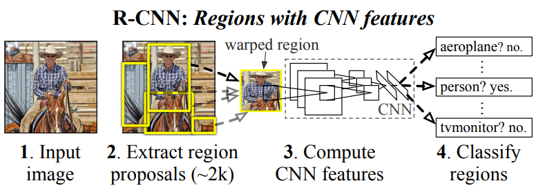
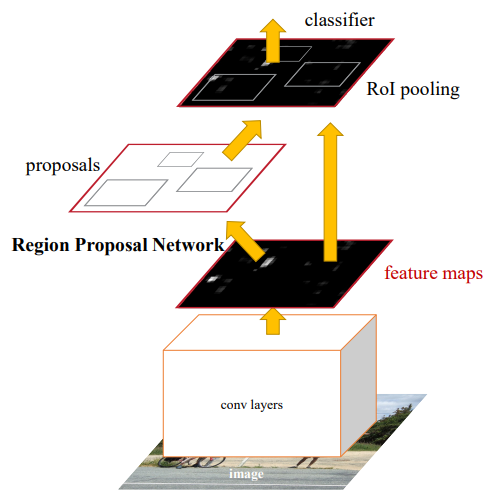

# Object Detection

## 종류
- 두 단계 방법: 영역 제안(region proposal)과 분류(classification) 두 단계를 거치는 방법
    - [R-CNN](#r-cnnregions-with-convolutional-neural-networks-features)
    - [Fast R-CNN](#fast-r-cnn)
    - [Faster R-CNN](#faster-r-cnn)
- 한 단계 방법: 영역 제안(region proposal)과 분류(classification)를 동시에 행하는 방법
    - [YOLO](#yolo)
    - [EfficientDet](#efficientdet)

---
## 두 단계 방법

### [R-CNN(Regions with Convolutional Neural Networks features)](https://doi.org/10.1109/CVPR.2014.81)

(논문에서는 RoI가 아닌 Region Proposal이라는 용어 사용)

**알고리즘**
1. Region proposal
    1.1. 입력 이미지에 대해 selective search 알고리즘을 적용해 약 2000개의 RoI(Region of Interest)를 찾는다.

2. Feature extraction
    2.1. 1.1에서 찾은 2000여 개의 RoI를 동일한 크기로 warpping 한다.
    2.2. warped image를 각각 CNN의 입력으로 사용하여 (RoI 개수)x4096 크기의 feature을 얻는다.
    2.3. 각 클래스마다, feacutre vector을 해당 클래스에 대해 훈련된 svm에 넣어 classification을 수행한다.
    2.4. greedy non-maximum suppression을 적용하여 영역을 추려낸다.(IoU가 큰 점수가 더 높은 영역이 있고, 학습된 threshold 값을 넘었을 경우)

---
[selective search](https://doi.org/10.1007/s11263-013-0620-5):

1. 이미지 픽셀의 색상, 질감, 방향 등의 특징을 이용하여 유사한 특징을 가진 그룹을 segment로 만든다.
2. 탐욕적 계층 알고리즘을 사용하여 유사한 segment를 병합한다.

### [Fast R-CNN](https://openaccess.thecvf.com/content_iccv_2015/html/Girshick_Fast_R-CNN_ICCV_2015_paper.html)

**R-CNN의 단점**
1. multi-stage pipeline을 훈련한다. bounding-box regressor, CNN, SVM 세 가지 모델을 훈련해야 한다.
2. 훈련 비용이 비싸다. 긴 시간과 큰 저장장치 용량이 필요하다.
3. detection이 느리다. 제안 영역을 각각 CNN의 입력으로 사용하여 detection이 느리다.

**Fast R-CNN의 특징**
- 전체 이미지와 RoI set을 network 입력으로 사용
- max pooling layer을 사용하여 feature map 간소화
- R-CNN의 영역 분류 단계에서 SVM을 신경망으로 변경
- RoI Pooling layer을 사용하여 특징 추출, 분류 및 bounding box regression이 하나의 모델에서 가능하다.

**알고리즘**
1. R-CNN과 마찬가지로 selective search를 통해 제안 영역을 찾는다.
2. 전체 이미지를 network 입력으로 사용. conv featuremap을 얻기 위해 conv layer과 max pooling layer 사용
3. feature map에 각 RoI를 적용하여 RoI(Region of Interest) pooling layer에 넣어 고정 크기의 feature vector를 얻는다.
4. 이 feature vector들은 FC layer을 통과한 뒤 softmax 함수와 bounding box regressor을 통과한다.
softmax 함수를 통해 물체를 분류하고, bounding box regressor을 통해 bbox 위치를 조절한다.

**RoI Pooling Layer**
Max pooling을 사용하여 RoI 영역을 고정된 $H \times W$ 크기의 feature map으로 변환

### [Faster R-CNN](https://proceedings.neurips.cc/paper/2015/hash/14bfa6bb14875e45bba028a21ed38046-Abstract.html)

**Fast R-CNN의 단점**
1. Region Proposal 단계에서 여전히 고전 알고리즘인 selective search를 사용한다.

**Faster R-CNN의 특징**
- Object detection networks와 convolutional layer을 공유하는 RPNs(Region Proposal Networks)를 사용한다. 

**RPN**

1. FCN의 마지막 layer에서 출력된 feature map에 sliding window 방식으로 $n \times n$크기(n=3)의 window를 사용해서 feature map에 convolution 연산을 진행.
2. 이 결과를 cls layer($1 \times 1$ convolutional layer)과 reg layer($1 \times 1$ convolutional layer)의 입력으로 사용
2-1. cls layer은 bbox에 객체가 있을 확률(점수)를 출력
2-2. reg layer은 bbox의 중심 x, y좌표, 높이, 너비를 출력

각 슬라이딩 윈도우 위치에서 동시에 여러 Region proposal을 예측
3종류의 종횡비와 3종류의 크기를 조합한 9개의 Anchor를 출력한다.

**작동 순서**
1. pre-trained VGG16에 800x800x3 이미지를 입력하여 50x50x512 크기의 feature map을 얻는다.
2. 원본 이미지의 크기에 sub-sampling ratio를 곱한 만큼 grid cell을 생성하고, 각 grid cell마다 9개의 anchor box를 생성한다.
3. RPN은 VGG에서 출력된 feature map을 입력받아 class score과 bbox를 얻는다.
4. proposal layer에서 anchor box와 RPN의 출력을 사용하여 region proposal을 추출
4-1. Non-maximum suppression(NMS)를 사용하여 많이 겹친 proposal을 제거
5. 위 결과를 Fast R-CNN의 입력으로 사용한다.

**4-Step Alternating Training**
1. RPN을 훈련
2. Fast R-CNN을 훈련
3. 공유하는 가중치(VGG16)를 고정하고, RPN을 Fine-tuning
4. 공유하는 가중치(VGG16)를 고정하고, Fast R-CNN을 Fine-tuning

---
## 한 단계 방법

### YOLO
버전:
- [YOLOv1](https://arxiv.org/abs/1506.02640)

    

    1. 이미지를 $S \times S$ 개의 grid로 나눈다.
    2. 각 grid는 B개의 bbox, 각 bbox의 신뢰도(bbox에 객체가 있고 bbox가 얼마나 정확한지), C개의 클래스 확률을 예측한다.

    

    > 모델 아키텍처
    이미지를 입력받아 $S \times S \times (B * 5 + C)$ 크기의 tensor를 반환한다.
    (논문에서, S = 7, B = 2, C = 20)

    단점:
    - 각 grid cell은 두 개의 bbox를 예측하고 하나의 클래스만 가질 수 있다.
    -> 예측 가능한 객체 수가 제한되고 그룹으로 나타나는 작은 객체를 탐지하기 힘들다.
    - 학습한 데이터에 없는 특이한 종횡비나 비율의 객체를 탐지하기 힘들다.
    - 여러 downsampling layer을 사용하기 때문에 거친(coarse) feature를 사용하여 bbox를 예측한다.
    - loss function이 큰 bbox와 작은 bbox의 오류를 동일하게 처리한다. 작은 bbox의 오류는 큰 bbox의 경우보다 IoU에 영향을 많이 준다.
- YOLOv3
- YOLOv4
- YOLOv5
- YOLOv8

### [EfficientDet](https://openaccess.thecvf.com/content_CVPR_2020/html/Tan_EfficientDet_Scalable_and_Efficient_Object_Detection_CVPR_2020_paper.html)

- EfficientNet에 Bidirectional Feature Pyramid Network(BiFPN), compound scaling 기법을 결합
- BiFPN: 다중 크기의 특징을 처리하는 Feature Pyramid Network(FPN)를 개선한 네트워크.
    - 하향식 FPN에 상향식 경로를 추가
    - 입력이 하나뿐인 노드를 제거하고 입력과 동일한 해상도 수준에 존재하는 출력 노드에 edge를 추가
    - 다른 해상도의 feature를 합칠 때 가중치를 추가하여 네트워크가 각 feature의 중요도를 학습하도록 함
- BiFPN을 하나의 layer로 취급하고 여러 반 반복하여 더 높은 수준의 feature을 융합
- compound scaling: backbone network, BiFPN network, class/box network 및 해상도의 모든 차원을 공동으로 확장하기 위해 간단한 복합 계수를 사용하는 방법
