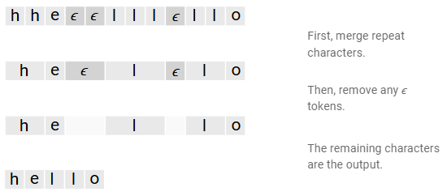
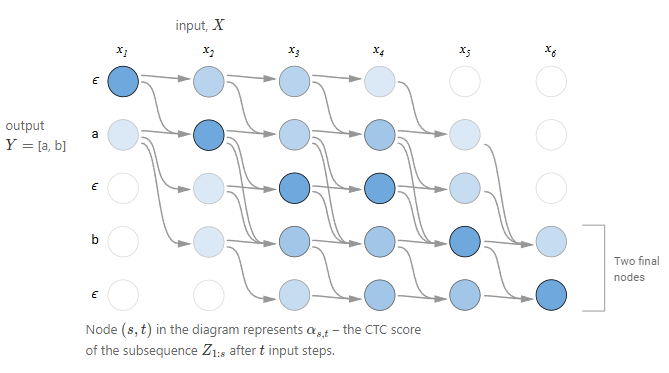

# Optical Character Recognition

---
Reference:
- https://arxiv.org/abs/2011.13534
- https://neverabandon.tistory.com/59
---

목차
1. [개요](#1-개요)
2. [방법](#2-방법)

## 1. 개요
**Optical Character Recognition(HPE)**:

### **필요성**:
- 

### 2. 방법
- 주로 문자 영역을 검출하는 Text detection과 검출된 영역의 문자를 인식하는 Text recognition으로 구분

#### 2.1. Text Detection
- 페이지나 이미지 내에 나타난 text를 찾는 작업
- 두 가지 방법
    - Text Detection as Object Detection
    - Text Detection as Instance Segmentation

- word-level versus character-level
    - 몇몇 논문에서 character-level detection이 word-level detection보다 쉽다고 주장

#### 2.2. Text Transcription
- 이미지에 나타난 text를 전사하는 작업
- 입력 이미지는 character, word 또는 word sequence에 해당하는 crop 이미지
- crop된 이미지를 입력받아 미리 정의된 vocabulary V에 속하는 token sequence를 출력
vocabulary V의 크기만큼 클래스를 갖는 다중 클래스 분류 문제로 생각할 수 있다.

- word-level text transcription 모델은 클래스 수가 character-level보다 훨씬 더 많기 때문에 더 많은 데이터를 필요로 한다.
    - word-level일 경우, 오자(잘못된 글자)를 만들 확률이 줄어든다.
    - vocabulary에 없는 단어는 전사할 수 없다.
    - subword 단위는 word 및 character-level 모두에 존재하는 문제를 완화할 수 있다.

token 전사를 위한 2개의 decoding 매커니즘
1. attention-based sequence decoder을 사용한 standard greedy decoding 또는 beam search
    - 이미지 방향이나 정렬이 잘못되는 경우 standard sequence attention의 효과가 저하될 수 있다.
    해결 방법:
        - He et al. 2018. [[paper]](https://openaccess.thecvf.com/content_cvpr_2018/html/He_An_End-to-End_TextSpotter_CVPR_2018_paper.html): attention alignment 사용
        
        
            - RNN branch는 새로운 text-alignment layer과 LSTM-based recurrent module로 구성
            - text-alignment layer은 감지된 영역 내에서 정확한 sequence feature을 추출하여 관련 없는 텍스트나 배경 정보를 인코딩하는 것을 방지한다.
            - character의 의미 있는 로컬 세부 정보와 공간 정보를 제공하는 mask supervision task 제안
            - 문자의 공간 정보를 명시적으로 encode하는 attention-alignment 메커니즘 제안

        - Shi et al. 2016. [[paper]](https://www.cv-foundation.org/openaccess/content_cvpr_2016/html/Shi_Robust_Scene_Text_CVPR_2016_paper.html): spatial attention mechanism을 직접 사용
        
        
            - Spatial Transformer Network(STN)
            TPS transformation을 사용하여 입력 이미지를 변환
                1. Localization Network를 사용해 기준점 예측
                2. Grid Generator 내에서 TPS 변환 매개변수를 계산
                3. grid와 입력 이미지를 입력으로 해서 sampler에서 수정된 이미지 생성

        
            - Sequence Recognition Network(SRN)
            이미지에서 sequence를 직접 인식하는 attention-based model
            Encoder:
                - 입력 영상에서 순차적 표현을 추출
            Decoder:
                - 각 step마다 관련 내용을 decoding하여 sequence 생성

2. connectionist temporal classification(CTC) loss 사용
    
    - sequence output에서 반복되는 character를 모델링하는 음성 분야의 일반적인 loss function
    - 네트워크 출력의 time step당 확률을 추정
    - output과 target이 정확하게 정렬되어 있지 않을 때 사용할 수 있는 loss
    - 연속된 character은 합치고, 실제 연속된 character 사이에는 공백 토큰을 삽입
    
    - loss를 계산할 때, 모든 정렬을 합산하는 대신 dynamic programming을 사용하여 빠르게 계산할 수 있다.
    참고 문서
        - CTC [[Paper]](https://dl.acm.org/doi/abs/10.1145/1143844.1143891)
        - https://distill.pub/2017/ctc/
        - https://velog.io/@adak0102/CtCloss
        - https://zerojsh00.github.io/posts/Connectionist-Temporal-Classification/

#### 2.3. End-to-end models
- text detection과 text transcription을 결합하여 공동으로 개선
예: text 예측의 확률이 매우 낮은 경우 감지된 상자가 전체 단어를 캡처하지 않았거나 텍스트가 아닌 것을 캡처함을 의미

- detection과 transcription을 분리했을 때 장점
    - 두 모델을 별도로 훈련할 수 있다.
    - 두 개의 개별 metric 집합을 쉽게 계산하고, 병목 현상이 발생하는 위치를 더 잘 이해할 수 있다.

- Liu et al. 2018. [[Paper]](https://openaccess.thecvf.com/content_cvpr_2018/html/Liu_FOTS_Fast_Oriented_CVPR_2018_paper.html)

    - Fast Oriented Text Spotting(FOTS) 제안
    - ROIRotate: bbox에 따라 feature map에서 적절한 feature을 가져옴

- He et al. 2018. [[Paper]](https://openaccess.thecvf.com/content_cvpr_2018/html/He_An_End-to-End_TextSpotter_CVPR_2018_paper.html)
    - 앞에 나온 논문

- Feng et al. 2019. [[Paper]](https://openaccess.thecvf.com/content_ICCV_2019/papers/Feng_TextDragon_An_End-to-End_Framework_for_Arbitrary_Shaped_Text_Spotting_ICCV_2019_paper.pdf)

    - TextDragon 제안
        - ROI의 왜곡을 수정하는데 특화된 차별화 가능한 ROI slide 연산자를 활용

- Liao et al. 2020.
    - Mask TextSpotter 제안
        - bounding box에 대한 ROI 네트워크와 text, character segmentation을 결합

### 3. Document Layout Analysis(문서 레이아웃 분석)

페이지의 사진이나 스캔한 이미지에서 ROI를 찾고 분류하는 작업

1. Page segmentation
    - 외관에 초점을 두고, 페이지를 별개의 영역(text, figures, image, table 등)으로 분할
2. Logical structural analysis
    - 이러한 영역에 대해 보다 세밀한 의미 분류를 하는데 중점을 둔다
    예: 단락 영역을 식별하고 이를 캡션이나 문서 제목과 구분

#### 3.1. Instance Segmentation for Layout Analysis
픽셀마다 label을 예측하여 관심 영역을 분류
유연하고, page segmentation이나 logical structural analysis같은 작업에 적용할 수 있다.

- Yang et al. 2017.
-

#### 3.2. Addressing Data Scarcity and Alternative Approaches
레이아웃 분석을 위한 고품질의 훈련 데이터를 얻는 것은 노동 집약적인 작업
- mechanical precision과 문서 내용에 대한 이해가 필요

새로운 도메인에서 문서의 레이아웃 annotation이 어렵다.
-> label이 없는 데이터의 구조를 활용하거나 잘 정의된 규칙을 사용하여 합성 label이 지정된 문서를 생성

#### 4. Information Extraction
다양한 레이아웃을 갖는 문서에서 구조화된 포맷으로 정보를 추출
예: 영수증에서 품목 이름, 수량, 가격 식별

#### 4.1. 2D Positional Embeddings
2D bounding box의 속성을 embedding하고, 이를 text embedding과 병합
-> 정보를 추출할 때 context와 공간 위치를 동시에 인식하는 모델 생성
-> Named Entity Recognition(NER) 방법을 강화하는 Multiple sequence tagging 방법 제안

#### 4.2. Image Embeddings
문서 정보 추출 모델의 목표: 정보를 의미론적으로 분할하거나 관심 영역에 대한 bounding box를 회귀하는 것
-> 문서의 레이아웃 유지에 도움이 된다.
-> 모델이 2D 상관 관계를 유지하는데 도움이 되며, 이를 활용할 수 있도록 한다.

문서 이미지에서 엄격하게 학습할 수 있지만, 텍스트 정보를 이미지에 직접 포함하면 모델이 2D 텍스트 관계를 이해하는 작업을 단순화 할 수 있다. ~
